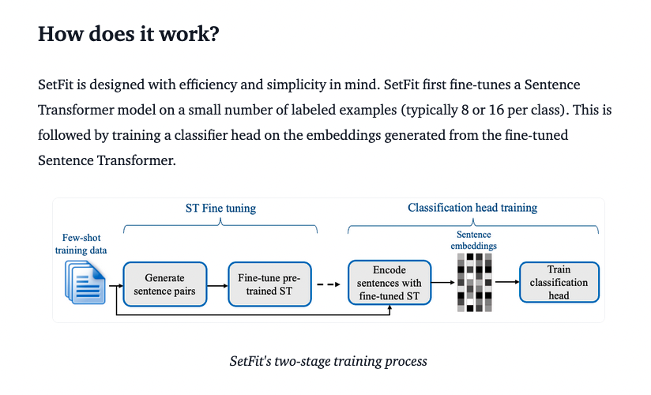
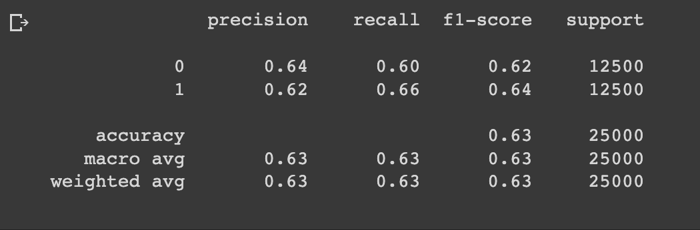
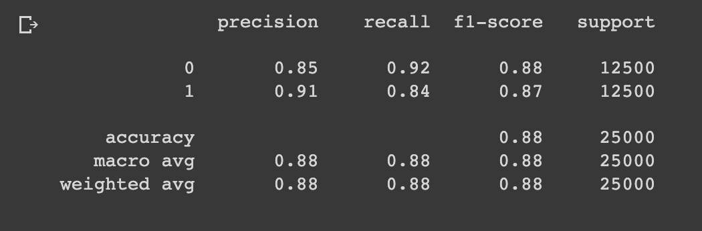

<!-- _class: title -->

# Zero-Shot and Few-Shot with OpenAPI and SetFit on IMDB
## 

---
<!-- paginate: true -->

# 1. Questões

1. **Explicação de conceitos importantes do exercício feito**
2. ~~Técnicas para garantir que a implementação está correta~~
3. ~~Truques de código que funcionaram~~
4. **Problemas e soluções no desenvolvimento**
5. ~~Resultados interessantes/inesperados~~
6. **Uma dúvida "básica" que você ou os colegas possam ter**
7. ~~Um tópico "avançado" para discutirmos~~

---

# 2. Explicação de conceitos importantes do artigo

[**SetFit**](https://github.com/huggingface/setfit) is an efficient and prompt-free framework for few-shot fine-tuning of Sentence Transformers. Based on the Customer Reviews sentiment datasets benchmark, SetFit is competitive and achieve comparable performance with only 8 labeled examples per class compared to fine-tuning RoBERTa Large with datasets of 3k labeled examples.

[**Sentence Transformers**](https://sbert.net/) SentenceTransformers is a Python framework for state-of-the-art sentence, text and image embeddings - **Based on embeddings, no prompts are required and supports multilingual text classification**

**Constrative Learning** puts similar embeddings together and try to spread apart the differences using loss functions like cosine similarity and others.

**Few-Shot Learning** is the practice of training a machine learning model with a small amount of data.

---

# 2.1 SetFit

---

# 3. Problemas e soluções no desenvolvimento

- first time using hf datasets
- discovered about langchain
- tutorial setFit https://huggingface.co/blog/setfit
- how to use setFit for zero-shot (notebook do Gustavo Bartz Guedes)

---
# 4. Resultados
<!-- _class: split -->

## SetFit
zero-shot

few-shot

## GPT-3.5 OpenAPI

zero-shot

few-shot

---

# 4. Uma dúvida "básica" que você ou os colegas possam ter

- zero-shot do SetFit não parece zero-shot pela definição do artigo do GPT-3 (mas é usado os embeddings do corpus como se fosse o LM...faz sentido)
- few-shot no setfit overfit pois só tem 8 amostras para cada label (é possivel fazer otimizar hyperparametros para dataset maiores)
- como o contexto é guardado em um um diálogo/conversa com chatgpt? ele guarda toda conversa naquele estilo da api que manda o diálogo, papéis (role) e conteúdo todo?
