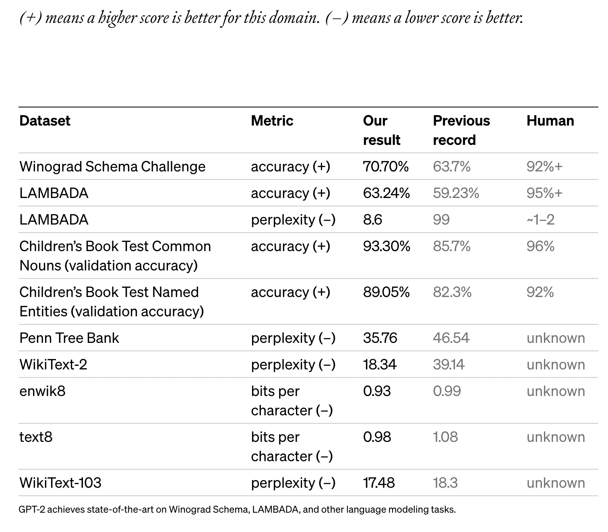
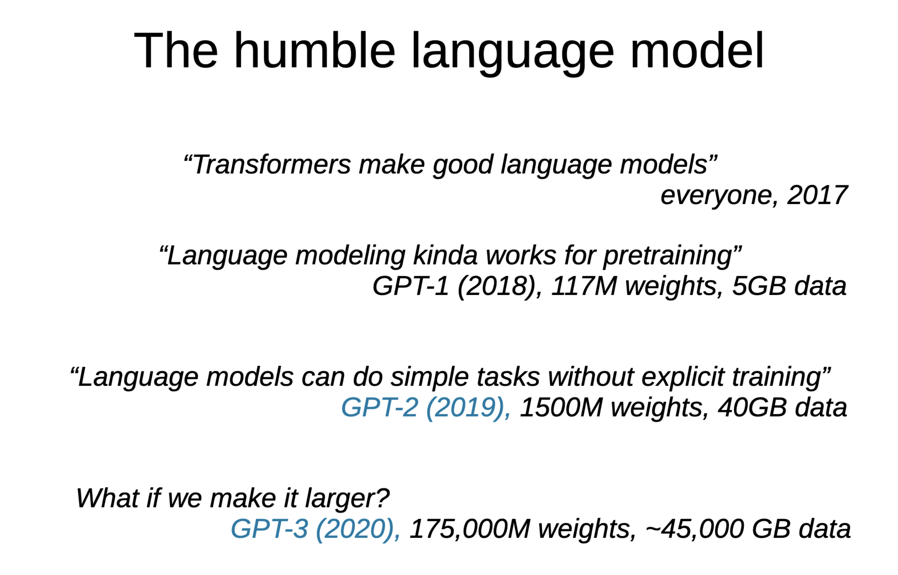
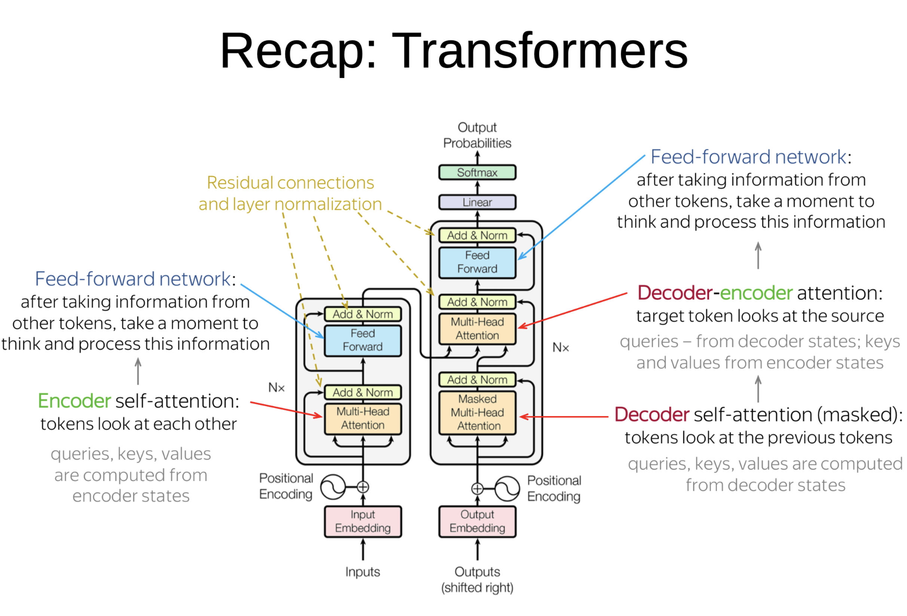
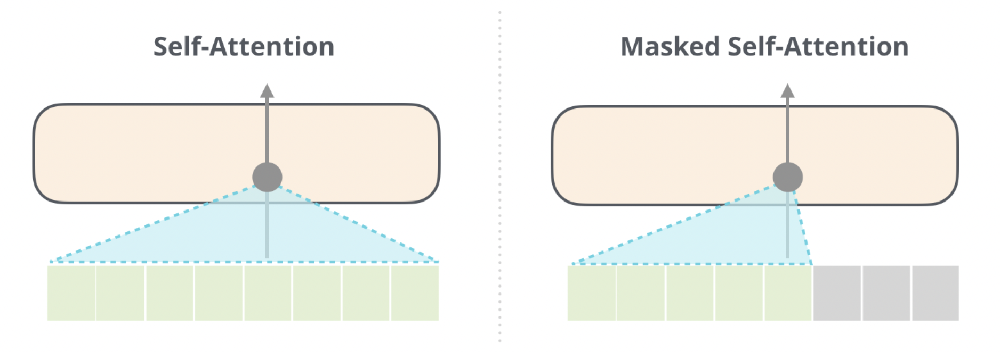

<!-- _class: title -->

# Language Models are Unsupervised Multitask Learners

## [GPT-2](https://github.com/openai/gpt-2)

---
<!-- paginate: true -->

# 1. Questões

1. **Explicação de conceitos importantes do artigo**
2. **A contribuição do artigo**
3. **Resultados interessantes/inesperados**
4. **Uma dúvida "básica" que você ou os colegas possam ter**
5. ~~Um tópico "avançado" para discutirmos~~

---

# 2. Explicação de conceitos importantes do artigo

1. GPT-2 LM treinado em um dataset de 40GB de texto (50k vocab) para prever a próxima palavra de uma sentença
2. **Language models**: um tipo de modelo de aprendizado de máquina que é treinado em grandes quantidades de dados de texto e pode gerar texto coerente e fluente.
3. **Context Embeddings** : a mesma palavra pode ter representações diferentes a depender do contexto da sua ocorrência, oposto do w2v que é fixo.

---

# 3. Contribuição

1. [WebText](https://github.com/openai/gpt-2/blob/master/domains.txt) dataset: 8 milhões de páginas web, 40GB de dados textuais. Curadoria ao criar o dataset com os dados do Reddit.
2. GPT-2 é um GPT aumentado 10X no tamanho dos parâmetros (1.5B) e dataset
3. Primeiro GPT que testou aplicação com zero-shot para algumas tarefas
4. Empilhamento de blocos de **decoder** (12-48) aumentando a dimensão dos embeddings (768-1600)

---

# 4. Resultados

1. GPT-2 atinge resultados SOTA para 7 de 8 tarefas em dataset com zero-shot. Tradução e sumarização com "*few-shot*"
2. Consistente melhora das métricas do modelo em diferentes tarefas *zero-shot* em diferentes dataset com o aumento do número de parâmetros/camadas/dimensões;
3. Pelo gráfico de performance (Figure 4) do artigo, percebe-se que a perplexidade não saturou. Indicando que ao aumentar o modelo a métrica tende a seguir melhorando. (o que foi confirmado com o GPT-3 e GPT-4)
4. Novamente o **disclaimer** de dados enviesados

<!--  -->
<!--  -->

---
4.2 Humble LM

---

# 5. Uma dúvida "básica" que você ou os colegas possam ter

1. O que é um modelo de linguagem e como ele funciona?
2. Como funciona a arquitetura Transformer?

---

# 5.1 O que é um modelo de linguagem e como ele funciona?

> Um modelo de linguagem é uma distribuição de probabilidade sobre sequências de palavras em um idioma. É um modelo estatístico que atribui uma probabilidade a todas as possíveis sequências de palavras em um determinado idioma.
>
> O objetivo de um modelo de linguagem é prever a probabilidade de uma sequência de palavras dada as palavras anteriores na sequência.
>
> Isso é feito aprendendo a distribuição de probabilidade condicional de cada palavra na sequência, dadas as palavras anteriores.

Podemos criar modelos de linguagem com RNN, CNN, LSTM, BERT...

---

# 5.2 Como funciona a arquitetura Transformer?

O Transformer é uma arquitetura de aprendizado profundo que foi introduzida em um artigo de 2017 chamado "*Attention Is All You Need*.". Ele tem como objetivo resolver tarefas de *seq2seq* para sequência, lidando com dependências de longo alcance com facilidade.

A arquitetura Transformer consiste em dois componentes principais: **Encoder** and **Decoder**

[Large Language Modelsand how to use them - Yandex](https://github.com/yandexdataschool/nlp_course/tree/2022/week03_lm)

<!--  -->
<!--  -->

---

# 5.2.1 Encoder (BERT)

> O encoder recebe a sequência de entrada de palavras e gera uma sequência de representações ocultas que capturam o significado da entrada. Ele consiste em várias camadas idênticas, cada uma das quais realiza duas operações:
>
> - **Self-attention**: Essa operação permite que o modelo pondere a importância de cada palavra na sequência de entrada ao gerar a representação oculta para cada palavra. Cada palavra recebe um peso com base em sua semelhança com as outras palavras na sequência. Isso permite que o modelo se concentre nas palavras mais relevantes para cada tarefa. (key, query, value embeddings projections from input)
> - **Feedforward**: Essa operação aplica uma transformação não linear a cada representação oculta para capturar ainda mais o significado da sequência de entrada.

---

# 5.2.2 Decoder (GPT)

> O decoder recebe as representações ocultas geradas pelo codificador e gera a sequência de saída de palavras. Assim como o codificador, ele consiste em várias camadas idênticas, cada uma das quais realiza duas operações:
>
> - **Masked self-attention**: Essa operação é semelhante à **self-attention** no codificador, mas é aplicada de maneira mascarada para impedir que o modelo olhe adiante e trapaceie usando palavras futuras para gerar a saída.
> - **Cross-attention**: Essa operação permite que o modelo pondere a importância de cada representação oculta gerada pelo codificador ao gerar a sequência de saída. Ajuda o modelo a alinhar as sequências de entrada e saída e gerar traduções ou resumos precisos.

---

# 5.2.3 Encoder and Decoder Attentions

<small>https://jalammar.github.io/illustrated-gpt2/</small>
