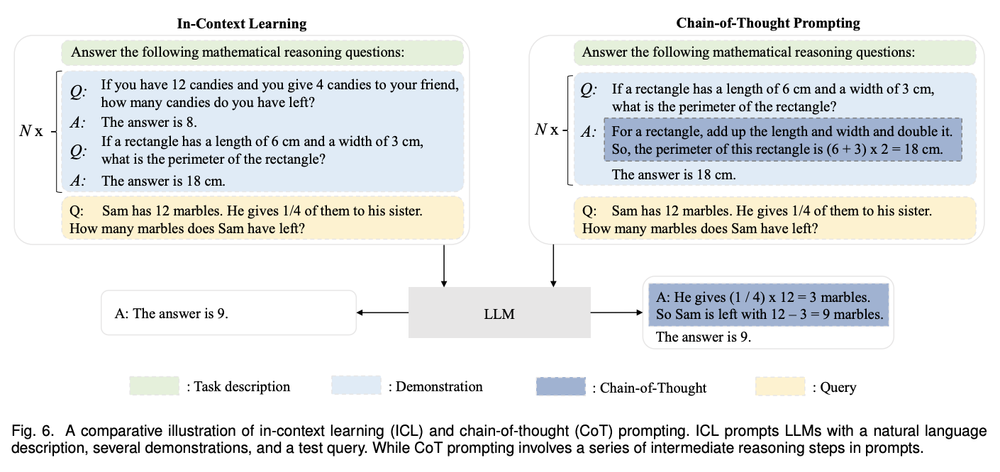

<!-- _class: title -->

# Document Expansion by Query Prediction + From doc2query to docTTTTTquery

## Thiago Coelho Vieira
---
<!-- paginate: true -->

# 1. Questions

1. **main concepts**
2. **contributions**
3. ~~interesting/unexpected results~~
4. ~~basic doubts~~
5. ~~advanced topics for discussion~~

---

# 2. Main Concepts Doc2Query and DoctttttQuery

1. **vocab mismatch problem**: is a problem, where users use query terms that differ from those used in relevant documents.
2. **document expansion:** The process of adding additional terms to a document to improve retrieval effectiveness. In this article, queries for a document are generated to be added to the original document as a way to mitigate vocab mismatch problem and improve retrieval results.

---

# 3.1 Contribution Doc2Query

1. First application of NN to document expansion - TODO: explain how it works
2. Inference computational cost using NN was transfered from query/inference time to indexing time
3. use BERT
4. 400 tokens for the documents and 100 tokens for the queries
5. generated queries are concatenated with the documento as input, before indexing
6. expanded document is indexed for IR using BM25
7. document expansions seems to be more effective than query expansion on the selected datasets

---

# 3.2 Contribution doctttttquery

1. uses T5 (encoder-decoder) instead of BERT (encoder)
2. 512 tokens documents and 64 tokens query
3. improved the results compared with the original doc2query article. T5 (220M) is 4x the original doc2query model size (60M)
4. low cost for training

---

# 4. Results

1. overhead transfered from inference time to indexing time
2. no major latency time increase in inference time
3. for the use in IR a couple of new tokens need to be added to BM25 inverted index
4. introduced a method for neural search using seq2seq models as a offline step before indexing in a IR pipeline

<!-- # advanced topics for discussion

<small>difference between in-context learning (ICT) and chain-of-thought (CoT) - [A Survey of Large Language Models] - https://arxiv.org/pdf/2303.18223.pdf</small>

> As a special prompting form, in-context learning (ICL) is first proposed along with GPT-3, which has become a typical approach to utilizing LLMs.
> ICL uses a formatted natural language prompt, consisting of the task description and/or a few task examples as demonstrations
>
> Chain-of-Thought (CoT) is an improved prompting strategy to boost the performance of LLMs on complex reasoning tasks, such as arithmetic reasoning, commonsense reasoning [240, 241], and symbolic reasoning.
> Instead of simply constructing the prompts with input-output pairs as in ICL, CoT incorporates intermediate reasoning steps that can lead to the final output into the prompts. -->
