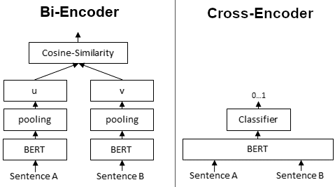
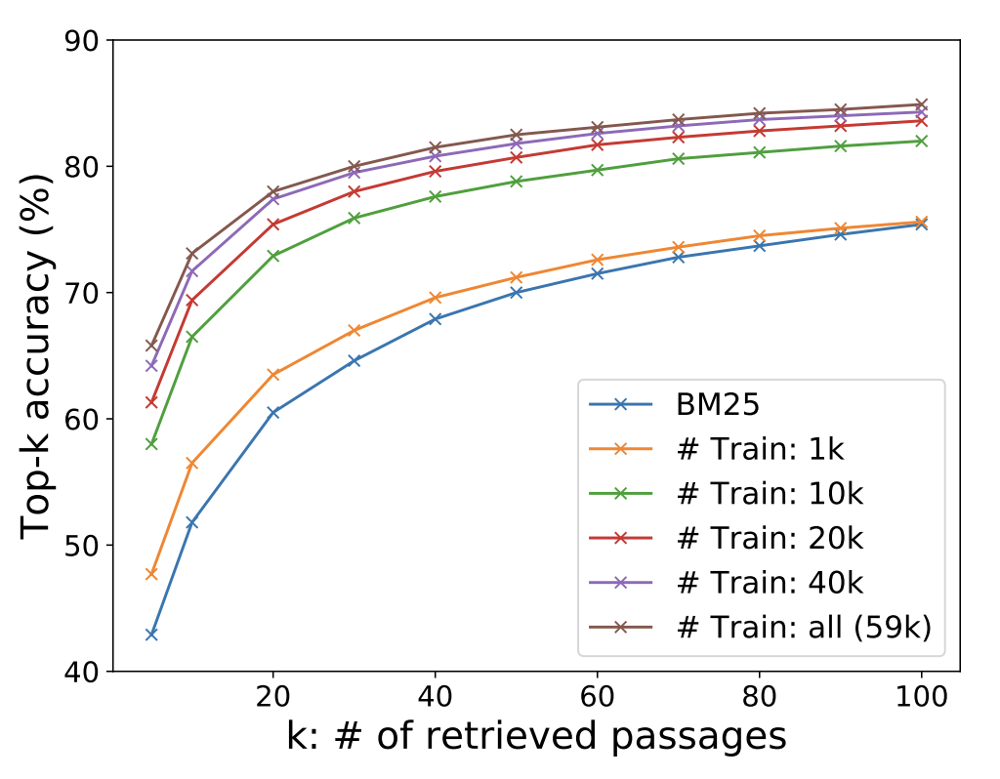

<!-- _class: title -->

# [Dense Passage Retrieval for Open-Domain Question Answering - 2020](https://arxiv.org/pdf/2004.04906.pdf)

## Thiago Coelho Vieira
---
<!-- paginate: true -->

# 1. Questions

1. **main concepts**
2. **contributions**
3. **interesting/unexpected results**
4. ~~basic doubts~~
5. ~~advanced topics for discussion~~

---

# 2. Main Concepts

1. **Open Domain QA**: is a task that answers factoid questions using a large collection of documents.
2. **Passage retrieval**: effectively reduces the search space for answer extraction, but also identifies the support context for users to verify the answer
3. **Sparse Vectors**: contains mostly zero values, and only a few non-zero values. Sparse vectors are commonly used to represent documents in a text corpus, where each dimension represents a word in the vocabulary. **TFIDF** and **BOW**. Matches keywords efficiently with an inverted index and can be seen as representing the question and context in highdimensional, sparse vectors (with weighting).
4. **Dense Vectors**: contains non-zero values for every dimension, and are often generated using techniques such as **word embeddings**, which capture the semantic meaning of words in a language. Can also be learnable by task-specific goal representation.
5. **Retriever model**: component that can select a small set of relevant texts
6. **Reader model**: component to extract the answer from the relevant texts
---

# 3 Contribution

1. **Goal**: `can we train a better dense embedding model using only pairs of questions and passages (or answers), without additional pretraining?`
   1. the goal of the dense passage retriever (DPR) is to index all the passages in a low-dimensional and continuous space.
   2. uses a dense encoder which maps any text passage to a embedding vectors and builds an index for all the passages that we will use for retrieval.
2. Effective result on using dense vector for document retrieval

---

# 3.1 Architecture

1. dual-encoder (bi-encoder) with BERT
   1. encoder 1 = question
   2. encoder 2 = possible answers
   3. output = embedding from [CLS] 768dim
   4. cost function = max dot product between output vectors (ablation study showed that other similarity functions perform comparably)

[image source](https://www.sbert.net/docs/pretrained_cross-encoders.html)

---

# 4. interesting/unexpected results

- empirical analysis and ablation studies indicate that more complex model frameworks or similarity functions do not necessarily provide additional values.
- simply fine-tuning the question and passage encoders on existing question-passage pairs is sufficient to greatly outperform BM25
- **Strategies**;
  - ds
- **Problems**:
  - fine-tunning dense vectors can is expensive in indexing and retrieval
  - may generate suboptimal representations
- **FAISS**: an extremely efficient, open-source library for similarity search and clustering of dense vectors, which can easily be applied to billions of vectors. Used for inference.
---

# 5. Results

<!-- _class: split -->

1. Outperforms Lucene-BM25 by 9%-19% absolute top-20
2. Outperforms BM25 by 65.2% vs. 42.9% in Top-5 accuracy
3. Stablish SOTA on multiple open domain QA benchmarks on models with the best retriever precision
4. `In the context of open-domain question answering, a higher retrieval precision indeed translates to a higher end-to-end QA accuracy.`
5. Demonstrated that dense retrieval can outperform and potentially replace the traditional sparse retrieval component in open-domain question answering. **Still holds?**

