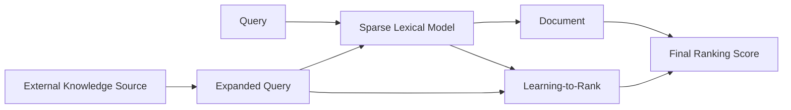

<!-- _class: title -->

# [SPLADE: Sparse Lexical and Expansion Model for First Stage Ranking](https://arxiv.org/pdf/2107.05720.pdf)

## Thiago Coelho Vieira
---
<!-- paginate: true -->

<!-- # 1. Questions

1. **main concepts**
2. **contributions**
3. **interesting/unexpected results**
4. ~~basic doubts~~
5. ~~advanced topics for discussion~~ -->

# 1.1 Main Concepts

1. **sparse vectors**: contains mostly zero values, and only a few non-zero values. Each dimension represents a word in the vocabulary. **TFIDF** and **BOW**. Matches keywords efficiently with an inverted index.

🔴 no fine-tuning  🟢 faster retrieval 🔴 semantics - exact term match/voca mismatch 
🟢 computation 🟢 interpretability

2. **dense vectors**: contains non-zero values for every dimension. Often generated using techniques such as **word embeddings**, which capture the semantic meaning of words in a language. Can also be learnable by task-specific goal representation.

🟢 can be fine-tunned 🟢 multi-modal - vector can be a representation of not only texts 🟢 semantics 🔴 computation 🔴 interpretability

---

# 1.2 Main Concepts

1. **(SPL) sparse lexical model**: model represents documents and queries using a sparse vector of weighted terms (TFIDF).
2. **sparsity constraints**: The SPLADE model introduces sparsity constraints on the document and query vectors to reduce noise and improve computational efficiency.
3. **query (E)expansion**: The SPLADE model uses an external knowledge source to expand the query with learnable term expansion, adding related terms that may not be present in the original query.
4. **learning-to-rank**: The SPLADE model uses a learning-to-rank approach to combine the scores from the sparse lexical model and the expanded query model into a final ranking score.

---

# 2.1 Contribution

1. the SPLADE paper proposes a novel approach for first-stage ranking that combines the strengths of sparse lexical models and query expansion techniques, while addressing some of the limitations of existing methods.
2. query expansion with BERT works as a way to learn terms that improve the original query more effectively based on their context (overcoming vocab mismatch)

---

# 2.2 Architecture

- the architecture allows the use of the outputs from the sparse retriever on different dense rerankers

---

# 3. interesting/unexpected results

- 
---

# 4.1 Results

---
# 4.2 Results

1. 

