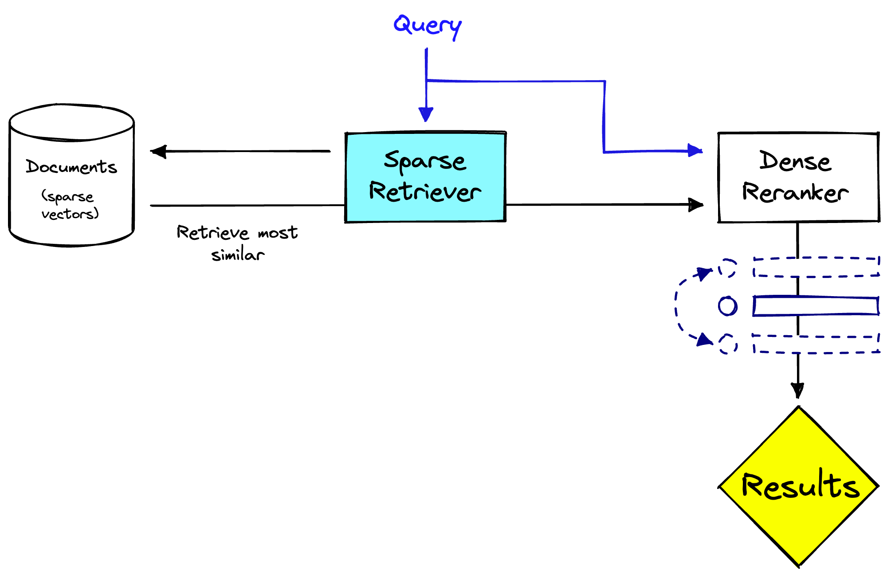

<!-- _class: title -->

# [SPLADE: Sparse Lexical and Expansion Model for First Stage Ranking](https://arxiv.org/pdf/2107.05720.pdf)

## Thiago Coelho Vieira
---
<!-- paginate: true -->

<!-- # 1. Questions

1. **main concepts**
2. **contributions**
3. **interesting/unexpected results**
4. ~~basic doubts~~
5. ~~advanced topics for discussion~~ -->

# 1.1 Main Concepts

1. **sparse vectors**: contains mostly zero values, and only a few non-zero values. Each dimension represents a word in the vocabulary. **TFIDF** and **BOW**. Matches keywords efficiently with an inverted index.

🔴 no fine-tuning  🟢 faster retrieval 🔴 semantics - exact term match/voca mismatch 
🟢 computation 🟢 interpretability

2. **dense vectors**: contains non-zero values for every dimension. Often generated using techniques such as **word embeddings**, which capture the semantic meaning of words in a language. Can also be learnable by task-specific goal representation.

🟢 can be fine-tunned 🟢 multi-modal - vector can be a representation of not only texts 🟢 semantics 🔴 computation 🔴 interpretability

---

# 1.2 Main Concepts

1. **SparTerm**: it's a Term-based Sparse representations, aiming to improve the representation capacity of bag-of-words(BoW)
method for semantic-level matching
2. **(SPL) sparse lexical model**: model represents documents and queries using a sparse vector of weighted terms (TFIDF).
3. **sparsity constraints**: The SPLADE model introduces sparsity constraints on the document and query vectors to reduce noise and improve computational efficiency.
4. **query (E)expansion**: The SPLADE model uses BERT as a source to expand the query with learnable term expansion, adding related terms that may not be present in the original query.

---

# 1.3 Main Concepts

<!-- _class: split -->

<small>[image source](https://www.pinecone.io/learn/splade/)</small>

---

# 2.1 Contribution

1. SPLADE is a new model that learns BERT-based sparse representations for queries and documents to effectively and efficiently retrieve documents by means of an inverted index.
2. replace the binarizer from the SparTerm with function that holds sparsity
3. query expansion with BERT works as a way to learn terms that improve the original query more effectively based on their context (overcoming vocab mismatch)
4. demonstrate a trade-off on sparsity regularization for performance and efficiency improvement (log saturation + ReLU lead to not importante terms to 0)
   1. Simply speaking, this regularization will penalize words that are often predicted but which are not really useful for retrieving relevant documents.
5. on SPLADE v2
   1. max pooling mechanism on weigths provided susbstancial improvement over the SPLADE baseline
   2. model distillation to improve performance and efficiency contribuited to get SOTA on MSMARCO passage classification task

---

# 2.2 Architecture

[image source](https://github.com/naver/splade)

---

# 3. interesting/unexpected results

- perfomance comparable to dense SOTA approaches
- able to compete with state-of-the-art dense models
- outperforms previous sparse approaches and dense baselines, and is able to compete with state-of-the-art dense models
