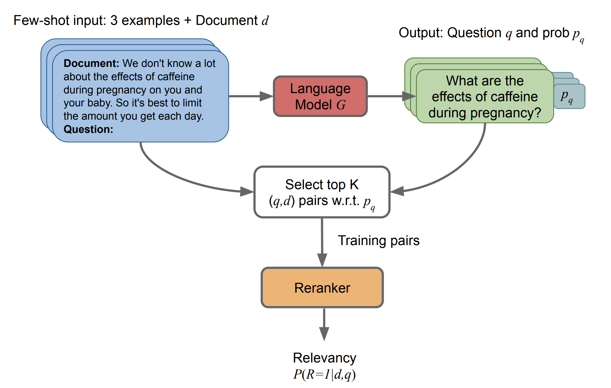

<!-- _class: title -->

# [InPars: Data Augmentation for Information Retrieval using Large Language Models](https://arxiv.org/pdf/2202.05144.pdf)

## Thiago Coelho Vieira
---
<!-- paginate: true -->

<!-- # 1. Questions

1. **main concepts**
2. **contributions**
3. **interesting/unexpected results**
4. ~~basic doubts~~
5. ~~advanced topics for discussion~~ -->

# 1.1 Main Concepts

- Synthetic Data Generation as a way to mitigate the lack of domain specific training data
- Prompt
- use few-shot to generate/augmentate new queries from the MSMARCO using a LM
- generate 100k queries in 100k docs pais $(q,d+)$, select top10k using the same model and than train/fine-tune the reranker
- from the 100k generated queries, select 10k relevant $top_k$ based on their probabilities
- BM25 was used to select non-relevant queries. For a given query $q$ retrieve 1000 docs with BM25, then random sample a $d-$ to get a non-relevant pair $(q, d-)$

---

# 1.2 Architecture

- LM $G$ generates a questions $q$ from a set with pairs $[(q_i,d_i)]$ with a relevance probability of $p_q$
- the top $K$ pairs $(q,d)$ based on $p_q$ are used as `positive` examples to train the reranker
- the `reranker` is responsible to estimate the relevancy of selected pair $(q,d)$ (relevancy of $d$ to $q$)

---

# 2.1 Contribution

- use synthetic data (on MSMARCO) generated from LM (v1: paid LLM GPT3-Curie and v2: free GPT-J 6B) using few-shot to fine-tuning reranker model as way to overcome the lack of data on specific taks
- adapt the use of LLM in IR beside its computation costs
- shift the cost of LM from the retrieval stage to generating training data
- use of simple prompt techinque as unsupervised approach (few-shot settings) to generate queries
- stablish SOTA with fine-tuning in 2 of 3 evaluated datasets

---

# 3. interesting/unexpected results

- approach to eval if gtp-3 was trained on supervised IR data
  - experiment: "measuring the number of questions produced by GPT-3 that match those in the MS MARCO dataset"
  - got low percentages on generated questions correlation with the ones from the dataset, this there are evidence that the models were not finetuned on MS MARCO, or at least, they did not memorize it
- gpt-3 model size increase
  - As the GPT3 model size used to generate synthetic questions were increased, the IR metric keeps increasing, although very slowly.
  - bigger models brings more complex and spefic questios which helps the reranker
- on future work
  - scale up our synthetic datasets to millions of examples (HOW?)
