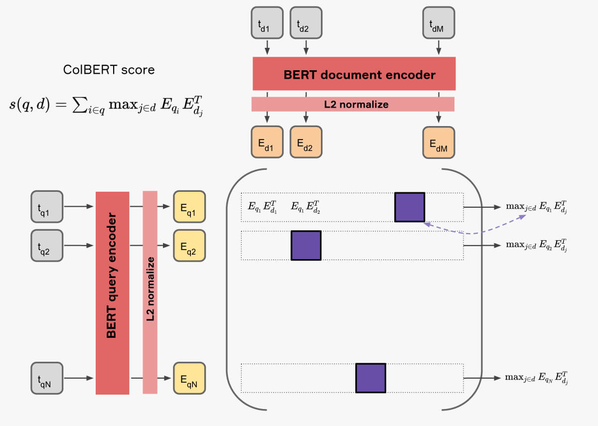
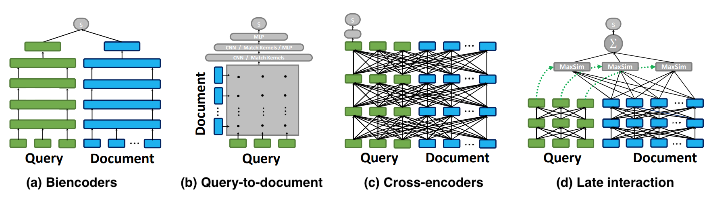
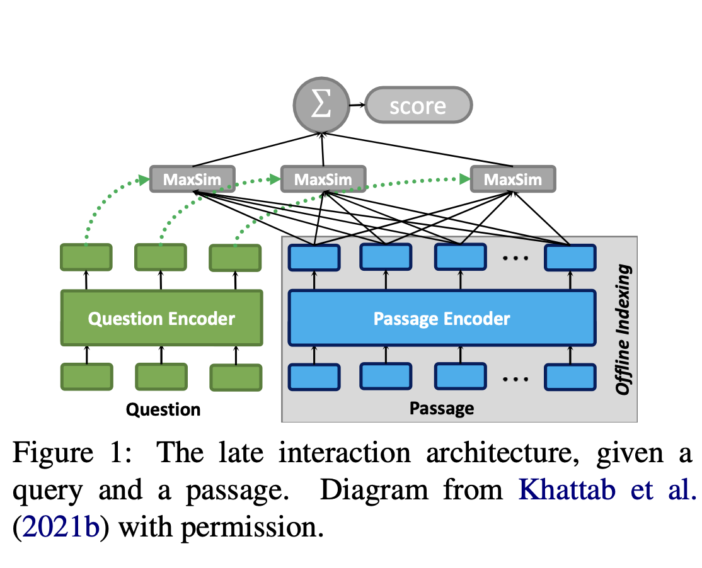

<!-- _class: title -->

# [ColBERTv2: Effective and Efficient Retrieval via Lightweight Late Interaction](https://arxiv.org/pdf/2112.01488.pdf)

## Thiago Coelho Vieira - thiagotcvieira@gmail.com
---
<!-- paginate: true -->

<!-- # 1. Questions

1. **main concepts**
2. **contributions**
3. **interesting/unexpected results**
4. ~~basic doubts~~
5. ~~advanced topics for discussion~~ -->

# 1.1 main concepts

- **ColBERTv1**
  - late interaction as a neural ranking paradigm
  - dense vector representation for each token
  - exact match vs soft match
  - promote exact match where it is more relevant to IR
- **single-vector** - a pretrained language model is used to encode each query and each document into a single high-dimensional vector, and relevance is modeled as a simple dot product between both vectors
- **multi-vector**
  - for a query/doc $q$ encoder outputs a matrix $nxD$, not a vector
- **trade-off** the cost of neural inference for reranking (GPUs) against the cost of large amounts of memory to support efficient nearest neighbor search

---

# 1.2 ColBERTv1

---

# 1.3 Interactions

---

# 1.4 MaxSim - similarity score

$$s_{q, d}=\sum_{i \in \eta(q)} \max _{j \in \eta(d)} \eta(q)_i \cdot \eta(d)_j$$

- largest cosine similarity between each query token matrix and all passages token matrix.

> constructs a similarity matrix, performs max pooling along the query dimension, followed by a summation to arrive at the relevance score
> 

---
# 1.5 how it works

- ColBERTv1
  - "two-stage" retrieval method
    - preprocess representation of each token from the corpus is computed and indexed (FAISS) for nearest neighbor search
    - on query time
      - use each query term vector to retrieve top-k texts from corpus using the index (maximizin in a single query term)
      - these top-k texts for each term query are scored against all query tokens vectors using *MaxSim* for reranking
---

# 1.6 ColBERTv2

---

# 1.7 how it works

- ColBERTv2
  - "two-stage" retrieval method
    - preprocess representation of each token from the corpus is computed and indexed (FAISS - ColBERTv1 and ) for nearest neighbor search
    - on query time
      - use each query term vector to retrieve top-k texts from corpus from the index
      - these top-k texts are scored against all query tokens vectors usin *MaxSim*

---

# 2.1 contributions

- improvements on ColBERTv2
  - residual compression approach significantly reduces index sizes using cluster centroids over the token level vectors space
  - better negative selection (*hard-negative mining*)
  - adds distillation from a cross-encoder system over the ...
  - ColBERTv1
    - 128dim vectors with 2 bytes = 256 bytes/vector
  - ColBERTv2
    - dimensionality reduction by arranging vectors in clusters indexed by 4 bytes ($2^{32})$ clusters)
    - improvement that enable 20-36bytes/vector
    - memory improvement ~6-10x (*residual compression*)
- multi-vectors are stored in cluster based on *MaxSim*
- new dataset *LoTTE (Long-Tail Topic-stratified Evaluation)*
---

# 2.2 contributions

- in-domain
  - beats $DPR$ and $SPLADEv2$
- gigantic index
  - ColBERTv1 $154GiB$ 🤯
  - ColBERTv2 $16GiB (1bit)$ and $25GiB (2bit)$
- $MMR@10$
  - 1bit $36.2$
  - 2bit $35.5$
- success@5 metric
- LoTTE dataset

# 3.1 interesting/unexpected results

- **exact and soft match** - ColBERT can distinguish terms of which exact match is important
  - for each term check average score in exact and soft cases (how?), if the difference is higher then favors exact match otherwise favors soft match
- **how promote exact match from contextualized embeddings?**
  - hyp: frequent words have contextualized embedding pointing to different directions
    - for important terms, contextual embeddings vary less, thus ColBERT will tend to select same term in docs (*consine sim close to 1*)
    - terms carrying  less information (is, the, as...) tend to absorb more the context in sequences, thus their embeddings vary more

---
# 4. basic doubts

- *long-tail topics* - `out of domain topics?`
- on ColBERTv1
  - the vector representation of each token is normalized to a unitary L2 norm; this makes computing inner products equivalent to computing cosine similarity.
  - relevance score is the sum of the max similarity between each vector of the query $q$ and all doc $d$ vectors

---
# 5. advanced topics

- ColBERTv3 ?
- PLAID ?
