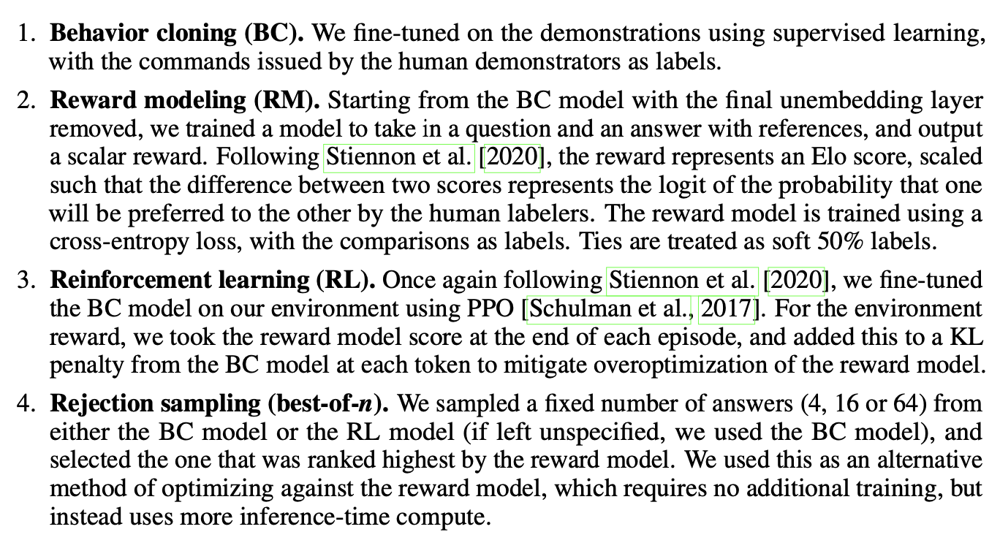

<!-- _class: title -->

# [WebGPT](https://arxiv.org/pdf/2112.09332.pdf) and [Visconde](https://arxiv.org/pdf/2212.09656.pdf)

## Thiago Coelho Vieira - thiagotcvieira@gmail.com
---
<!-- paginate: true -->

<!-- # 1. Questions

1. **main concepts**
2. **contributions**
3. **interesting/unexpected results**
4. ~~basic doubts~~
5. ~~advanced topics for discussion~~ -->

# 1.1 main concepts

- **WebGPT**
  - **imitation learning**
    - submits search queries, follows links, and scrolls up and down web pages
  - **human preferences** approach from fine-tuning [GPT-2](https://openai.com/research/fine-tuning-gpt-2) to produce answers more human-like
  - **long-form question-answering (LFQA)** : paragraph-length answer is generated in response to an open-ended question
  - **factual accuracy** : support answers references (mitigate model "*hallucination*")
  - **demonstrations**: examples of humans using the browser to answer questions
  - **comparisons**: pairs of model-generated answers to the same question, and asked humans which one they preferred to optimize answers quality (*better, worse or equally good overall*)

---

# 2.1 contributions

- **WebGPT**
  - leverage existing information retrieval (Bing Web Search API) and synthesis (GPT3 fine tunned) to solve LFQA
  - optimize answer quality using human feedback (**comparisons**) 
  - provide answers with citation from the articles of the retrieval step as a factual proof
  - developed a end-to-end open-ended Q/A system using a text-based web browser [WebGPT Answer Viewer](https://openaipublic.blob.core.windows.net/webgpt-answer-viewer/index.html)

---

# 2.2 WebGPT

- GPT-3 to use a text-based web-browser trained on 6000 **demonstrations** and 21500 **comparisons** and 4 different training methods (BC, RM, RL and best-of-$n$)
- the model is provided with an open-ended question and a summary of the browser state and must issue commands (search, find in page, quote, scroll...)
- retrieved text from hits are used to compose a crafted (text-based web-browser state) prompt for *GPT-3* produce the answers with the citations
- trained a reward model to predict human preferences, and optimizing against it using either reinforcement learning or rejection sampling (*demonstrations* and *comparisons*)

---

# 3.1 interesting/unexpected results

- **WebGPT**
  - retrieve 64 hits (Bing)
  - fine tuned *GPT-3* 760M, 13B and 175B
  - post-processing dataset, demonstration interface, comparison denoising (appendixes)
  - use moslty *ELI5* dataset of open-ended questions scraped from the "Explain Like I'm Five" subreddit
  - answers are factually accurate as those written by our human demonstrators
  - best model produced answers that were **prefered 56%** of time against the ones written by humans.
  - do not work very well in *OOD* questions from *ELI5* dataset
  - *TruthfulQA* an adversarially-constructed dataset of short-form questions (scored on *truthfulness* and *informativeness*)
  - model answers are **true 75% of the time**, and are **both true and informative 54% of the time**
  
---
# 4. basic doubts

- **WebGPT**
  - what are the human *demonstrations*? examples of humans using the browser to answer questions
  - what passages from the site are picked? simply picked passages with the term on it
  - how to cherry-pick the best sources? (Bing, Google, private IR)

---
# 5. advanced topics

- **WebGPT**
  - bring light to the challenges and risks of allowing general-purpose AI system like this to access and work directly on information from the web.
    - what sources are reliable
  - it's something like plugins of the ChatGPT and AgentGPT does nowadays
  - answers with citations can obscure the fact that our model still makes basic errors
