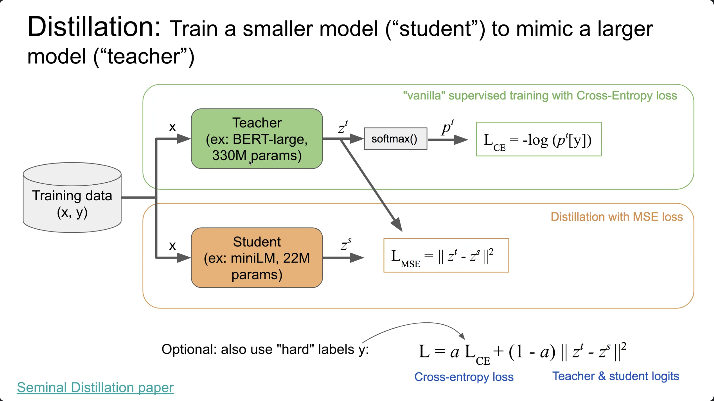

# Class 10 Notes 11/05/2023

- **APRESENTAÇÕES ARTIGO ColBERTv2**

- 
  - student model menor tenta imitar os logits do teacher (freezed) usando MSE
  - colbertv2 imita o reranqueador minilm crossencoder
    - reranqueia os centroids da primeira fase pra buscar os termos e fazer o maxsim
- GTR/XTR(neural 5B, muita indexacao, 1 estagio sem ranqueador) unico vetor e igual o ColBERT
- melhorar busca esparsa e densa parece só melhorar com
  - usando destilaçao ou;
  - aumentando o modelo

- **APRESENTAÇÕES NOTEBOOK**

- qualquer melhoria (doc2query, por exemplo) em primeira estágio de busca não faz diferença no resultado do renrank posterior
- pyterrier parece legal, mas não conseguiram usar legal
- melhor usar o rank do que o score pra combinar renranquer pq a distribuição dos scores variam muito
  - usar o rank pra fazer a ponderação
- ndgc > 80 - uma pessoa ranqueando e outra revisando gera em torno de > 80. Fica difícil avaliar acima desse limiar pq trocando a pessoa mudaria
- latência nem sempre é problema pq vc pode colocar computação pra resolver isso (claro q tem limite, mas posso colocar + gpu). Do ponto de vista negocial existe o trade-off do valor q isso traz. 
- custo parece ser uma melhor métrica
- latency/budget
  
- **Discussions**

- FUTURO
  - busca incorporado no modelo
    - o indice com os ids e trechos do documento serem na verdade parte do pretreino inserido nele
- https://www.youtube.com/watch?v=hhiLw5Q_UFg

## article

- WebGPT and Visconde
- Visconde
  - não prestar atenção em docs não relevantes: prompt ajuda a remover os docs não relevantes
  - sistema de busca (BM25) é o gargalo nesse tipo de arquitetura pq ele se ele trouxer os docs errados aí não adianta pq o LLM não vai saber
  - Gold ctx - humanos (artificial)

## code assignment

- create a perplexity.ai like solution
- https://github.com/neuralmind-ai/visconde
  - https://github.com/neuralmind-ai/visconde/blob/main/iirc_rerank.ipynb
  - F1 - https://github.com/neuralmind-ai/visconde/blob/main/iirc_generate_and_evaluate.ipynb
- desenvolver o prompt no playground do openai ou https://chat.lmsys.org/
- usar o gpt-3.5-turbo inicialmente
  - vicuna13B ~ chatgpt em tarefas de diálogo. Tem no hf (treinado no llama com dataset do share-gpt chatgpt)
- usar ou não o decomposition step (bm25 ou SPLADE)

### Instructions

Implementar um pipeline multidoc QA: dado uma pergunta do usuário, buscamos em uma grande coleção as passagens mais relevantes e as enviamos para um sistema agregador, que irá gerar uma resposta final.

- Avaliar no dataset do IIRC
- Métrica principal: F1
- **Limitar dataset de teste para 50 exemplos para economizar.**
- Usar o gpt-3.5-turbo como modelo agregador. Usar vicuna-13B como alternativa open-source:
  - https://huggingface.co/helloollel/vicuna-13b
  - https://chat.lmsys.org/

Dicas:
Se inspirar no pipeline do Visconde: https://github.com/neuralmind-ai/visconde
